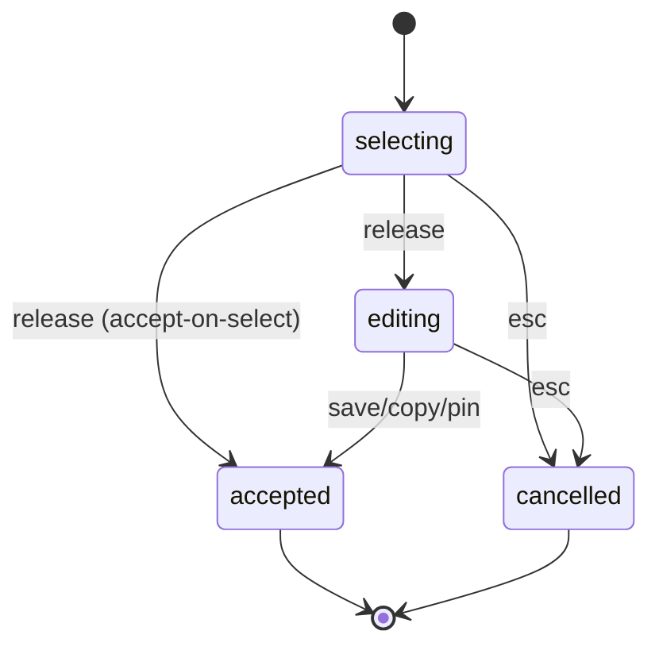

# State Machines

**Last Updated:** 2026-10-06 (initial: capture overlay lifecycle)

## 1. Capture Overlay

**Source:** src/widgets/capture/capturewidget.cpp:302

### States
| State | Meaning |
|-------|---------|
| selecting | Full-screen overlay shown, user choosing a region. |
| editing | Region chosen, annotation toolbar shown. |
| accepted | User confirmed; capture exported when the overlay is destroyed. |
| cancelled | Overlay closed without a capture. |

### Transitions
| From | To | Trigger | Guard |
|------|----|---------|-------|
| selecting | editing | Mouse release on a region | ACCEPT_ON_SELECT not set |
| selecting | accepted | Mouse release on a region | ACCEPT_ON_SELECT set |
| editing | accepted | Save / copy / pin action | Selection not empty |
| selecting | cancelled | Escape or right click | none |
| editing | cancelled | Escape | none |

### Diagram

