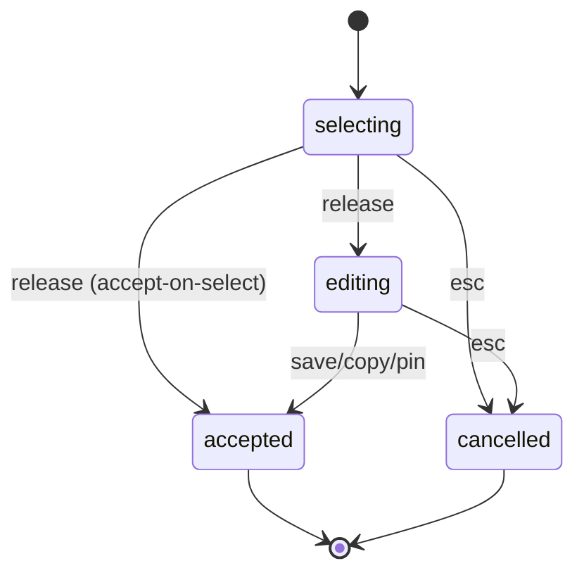
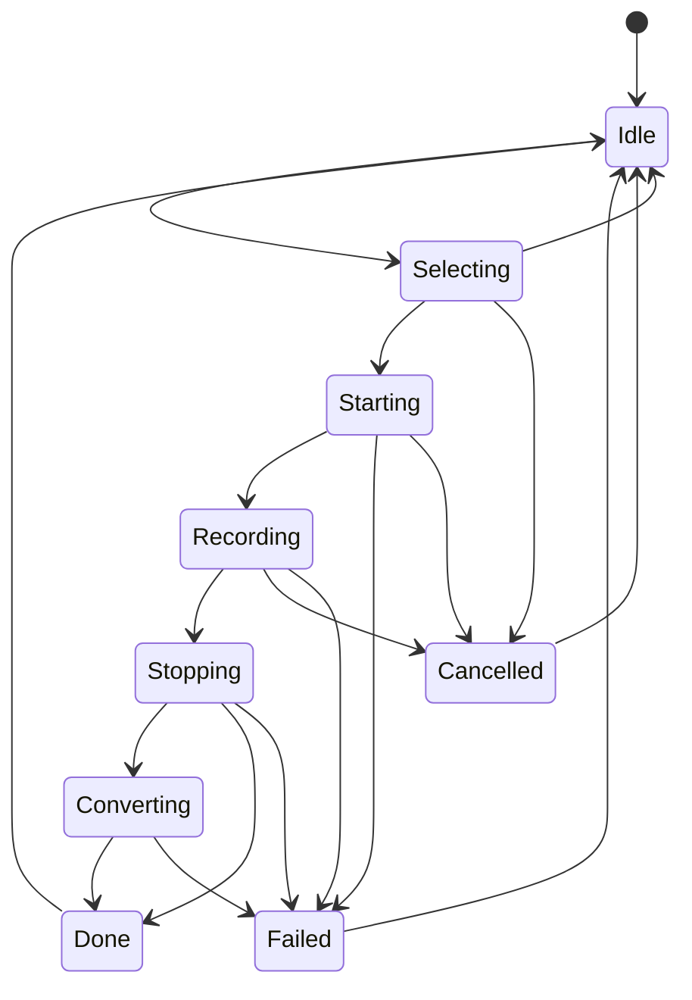

# State Machines

**Last Updated:** 2026-10-07 (screen recording lifecycle)

## 1. Capture Overlay

**Source:** src/widgets/capture/capturewidget.cpp:302

### States
| State | Meaning |
|-------|---------|
| selecting | Full-screen overlay shown, user choosing a region. |
| editing | Region chosen, annotation toolbar shown. |
| accepted | User confirmed; capture exported when the overlay is destroyed. In captureFirst mode a toast follows the save. |
| cancelled | Overlay closed without a capture. |

### Transitions
| From | To | Trigger | Guard |
|------|----|---------|-------|
| selecting | editing | Mouse release on a region, or click on a highlighted window | ACCEPT_ON_SELECT not set |
| selecting | accepted | Mouse release on a region, or click on a highlighted window | ACCEPT_ON_SELECT set (CLI flag, or captureFirst hotkey/tray request) |
| editing | accepted | Save / copy / pin action | Selection not empty |
| selecting | cancelled | Escape or right click | none |
| editing | cancelled | Escape | none |

### Diagram

## 2. Screen Recording

**Source:** `src/core/recordingstate.h` (`RecState`, `canTransition`), driven by `src/core/recordingcontroller.cpp`.

### States
| State | Meaning |
|-------|---------|
| Idle | No recording in progress. |
| Selecting | Area picker overlay open. |
| Starting | Area chosen, control window shown, stream starting. |
| Recording | Frames are being written to the temp MP4. |
| Stopping | Waiting for the native recorder to finalise the file. |
| Converting | GIF only: temp MP4 is being turned into a GIF. |
| Done | File saved; history entry and toast follow. |
| Failed | Start, record, stop or conversion failed. |
| Cancelled | User cancelled while recording; temp file discarded. |

### Transitions
| From | To | Trigger | Guard |
|------|----|---------|-------|
| Idle | Selecting | Record hotkey or tray item | none |
| Selecting | Starting | Area picked | none |
| Selecting | Cancelled | Cancel | none |
| Selecting | Idle | Overlay closed with no area | none |
| Starting | Recording | Native stream started | none |
| Starting | Failed | Stream failed to start | none |
| Starting | Cancelled | Cancel during the start delay | none |
| Recording | Stopping | Stop button or same hotkey | none |
| Recording | Cancelled | Cancel button | none |
| Recording | Failed | Native error mid-recording | none |
| Stopping | Converting | File finalised | GIF mode |
| Stopping | Done | File finalised | MP4 mode |
| Stopping | Failed | Finalise error or timeout | none |
| Converting | Done | GIF written | none |
| Converting | Failed | Conversion error | none |
| Done, Failed, Cancelled | Idle | Cleanup finished | none |

### Diagram

